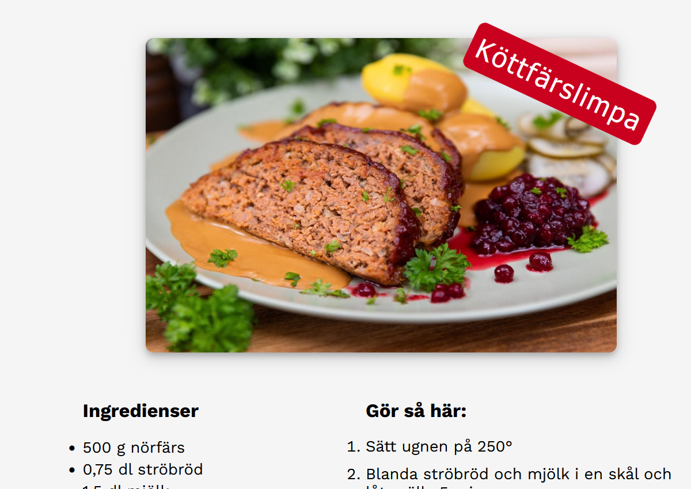
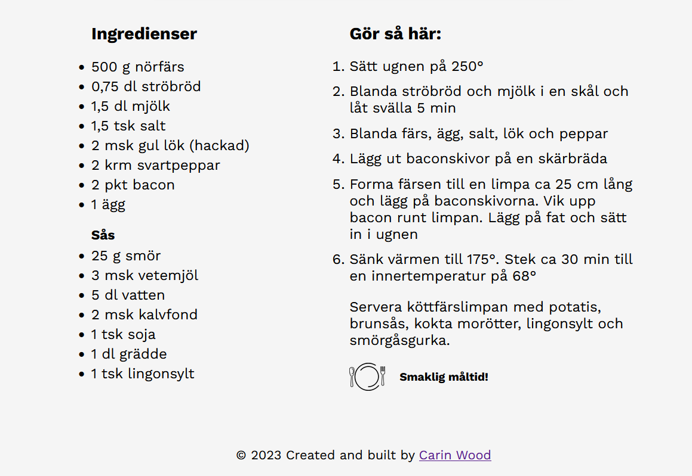
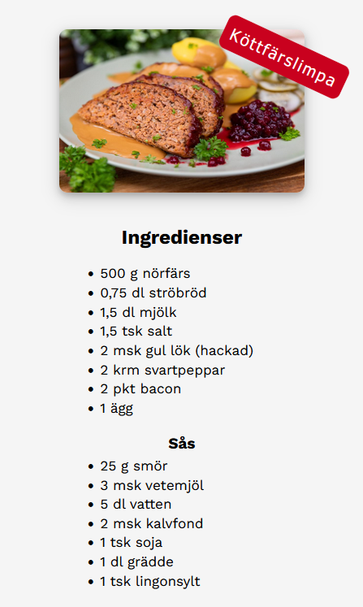

# My favourite recipe

This is a small project with html and css. The project is responsive for mobile phones.

Visit site: https://favoritrecept.vercel.app/

## Images from the project:

## Responsive CSS:

